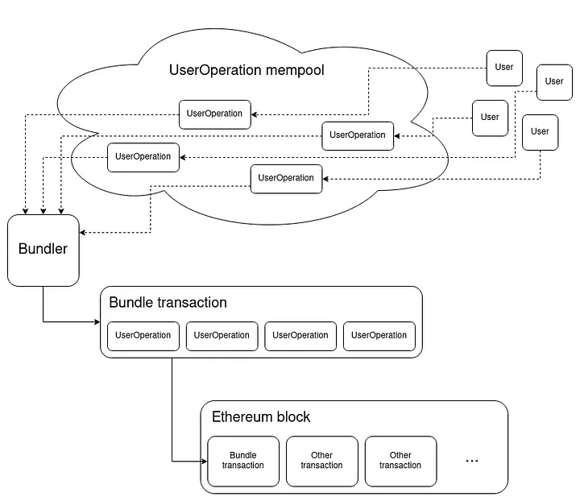

# What is Account Abstraction?

Account abstraction is a new approach to how users manage their accounts. It allows users to use smart contracts as wallets, reducing the need for EOAs (externally owned accounts) like MetaMask, Keplr, etc.

In the EVM, there are two types of accounts:

* **EOA (Externally Owned Account):** Controlled by a private key.
* **Contract Account:** Controlled by code. These accounts can’t initiate transactions on their own; they only act when called.

Both types of accounts share common features: they can hold assets, transfer funds, and interact with other accounts. The key difference is that only EOAs can create transactions, making them essential for interacting with contracts.

However, EOAs have limitations:

* **Limited security:** EOAs use public-key cryptography, where control of the wallet and its assets depends on the private key. If this key is leaked or shared, whoever holds it gains complete access to the assets without any safeguards.
* **Lack of customization:** EOAs lack flexibility, as they don’t let users assign partial access to funds or set custom spending limits, forcing reliance on external solutions for these needs.
* **Lack of future-proofing:** As quantum computing advances, EOAs provide no built-in protection against potential future vulnerabilities.

Account abstraction addresses these issues by decoupling transaction verification from how transactions are processed on the blockchain. Let's explore how this works.

### Current State

From the beginning, there have been several attempts to bring account abstraction to Ethereum (Vitalik discusses this in his talks). More recently, with ERC-4337, the Ethereum community is getting closer to defining how account abstraction will function for users.&#x20;

While ERC-4337 is still a draft, it doesn’t require changes at the consensus level, allowing various teams to experiment and build tools around it.

### ERC-4337

ERC-4337, titled "Account Abstraction Using Alt Mempool," was proposed by Vitalik Buterin, Yoav Weiss, Dror Tirosh, Shahaf Nacson, Alex Forshtat, Kristof Gazso, and Tjaden Hess. It introduces a workflow that separates transaction validation (via **UserOperation**) from transaction inclusion on the blockchain, using special actors called **Bundlers**.

Let’s look at the key components:

* **UserOperation:** A higher-level object containing transaction intent and verification data.
* **Bundlers:** Special actors that collect UserOperations, consolidate them into bundle transactions, and send them to the network for inclusion.
* **EntryPoint:** A singleton contract responsible for validating and executing all UserOperations.

There are other elements like account contracts and paymasters, which we will cover in later sections. For now, keep the key components in mind.

#### UserOperation Flow

When a user wants to send a UserOperation, it is sent to a special mempool for bundlers to collect. Bundlers then gather several UserOperations, bundle them, and send them to the **EntryPoint**, which validates, executes, and reimburses the bundler for transaction costs.

Here’s the general flow:

<figure><figcaption>
<a href="https://medium.com/infinitism/erc-4337-account-abstraction-without-ethereum-protocol-changes-d75c9d94dc4a">https://medium.com/infinitism/erc-4337-account-abstraction-without-ethereum-protocol-changes-d75c9d94dc4a</a>
</figcaption></figure>
